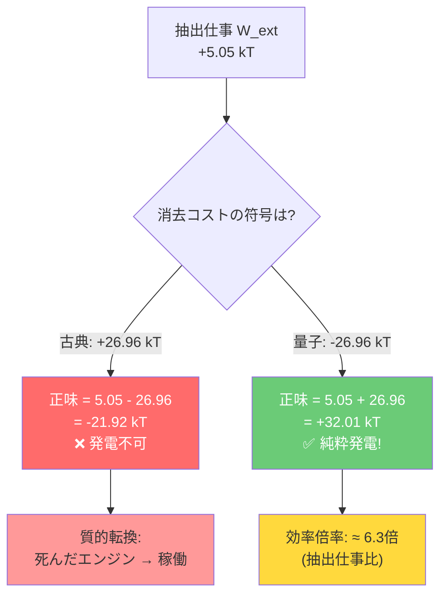

# TEGモジュール増設と量子コスト反転の効果分析

## 質問1: TEGモジュールを増やしても発電量に変化はないのか？

### 結論: **変化します。ただし、単純な比例増加ではありません。**

---

### 現在の設計

[設計書](file:///home/imaken/notebook_project/Maxwells_demon/thermal_demo_design/設計書_構成C_情報エンジン.md) では **SP1848-27145 を1枚** 使用しています。

| パラメータ | 値 |
|:---:|:---:|
| TEGモジュール | SP1848-27145 × 1枚 |
| ゼーベック係数 α | ≈ 0.04〜0.05 V/K（モジュール全体） |
| 開放電圧 (ΔT=10℃) | ≈ 200〜250 mV |
| 内部抵抗 | ≈ 2〜5 Ω |

### TEG増設のパターンと効果

#### パターンA: 直列接続（電圧を上げる）

```
TEG1 → TEG2 → TEG3 → ... → 昇圧回路
 +  -   +  -   +  -
```

| 枚数 | 開放電圧 (ΔT=10℃) | LTC3108動作 | 効果 |
|:---:|:---:|:---:|:---:|
| 1枚 | ≈ 200 mV | ✅ 動作（最低20mV） | 基準 |
| 2枚 | ≈ 400 mV | ✅ より安定 | 昇圧効率向上 → **充電速度が改善** |
| 3枚 | ≈ 600 mV | ✅ 高入力 | 昇圧効率さらに向上 |

> [!IMPORTANT]
> **直列接続の場合**: 電圧は N倍になるが、電流は変わらない（同じ温度差の場合）。LTC3108は入力電圧が高いほど変換効率が向上するため、**発電量は枚数に比例以上に改善** する可能性がある。ただし、LTC3108の入力電圧上限（500mV推奨）を超えないよう注意が必要。

#### パターンB: 並列接続（電流を上げる）

```
TEG1 ──┐
TEG2 ──┼── 昇圧回路
TEG3 ──┘
```

| 枚数 | 開放電圧 | 短絡電流 | 効果 |
|:---:|:---:|:---:|:---:|
| 1枚 | ≈ 200 mV | ≈ I₀ | 基準 |
| 2枚 | ≈ 200 mV | ≈ 2×I₀ | **電力は約2倍** |
| 3枚 | ≈ 200 mV | ≈ 3×I₀ | **電力は約3倍** |

> [!TIP]
> 並列接続は電圧を変えずに電流を増やすため、出力電力 $P = V \times I$ が枚数にほぼ比例して増加する。これが**発電量を直接的に増やす最もシンプルな方法**。

#### パターンC: 直並列ハイブリッド

2枚直列 × 2系統並列 = 4枚 → 電圧2倍 × 電流2倍 = **電力4倍**

### 発電量が「変わらない」ように見える理由

現在の構成C（情報エンジン）では、ボトルネックは TEG の発電量ではなく：

1. **LTC3108の変換効率**: 入力電圧が低い（≈200mV）領域での効率は 10〜30%
2. **スーパーキャパシタの充電速度**: 0.47F を充電するのに時間がかかる
3. **悪魔（Arduino）の消費電力が圧倒的**: 150 mW >> TEG出力（数 mW）

```
TEG出力  ≈  2〜8 mW (ΔT=10℃, 1枚)
Arduino  ≈  150 mW  (常時)
──────────────────────
差分     ≈  -142 mW  ← TEGを何枚増やしても追いつかない
```

> [!WARNING]
> **TEGを増やしても「正味仕事」は負のまま**です。これは設計の欠陥ではなく、**論文が主張している古典的ランダウアー限界の実証**そのものです。Arduino（古典的悪魔）の情報処理コストがエネルギー抽出を上回ることが、実験の核心的なメッセージです。

### TEG増設の実用的な効果

| 改善項目 | 1枚 | 2枚（並列） | 3枚（並列） |
|:---:|:---:|:---:|:---:|
| TEG出力 | ≈ 2〜8 mW | ≈ 4〜16 mW | ≈ 6〜24 mW |
| キャパシタ充電時間 | 1〜5 分 | 30秒〜2.5分 | 20秒〜1.5分 |
| LEDパルス頻度 | 数十秒に1回 | 数秒〜十数秒に1回 | 数秒に1回 |
| デモの見栄え | △ | ○ | ◎ |
| 正味仕事 (古典) | **負** | **負** | **負** |

**結論**: TEGを増やすとLEDの点灯頻度や明るさは改善されますが、Arduino（悪魔）の消費電力を上回ることはできず、**正味仕事は依然として負**のままです。

---

## 質問2: 消去コストが負に反転すれば、発電効率は何倍になるか？

### シミュレーション結果から直接計算

[simulate_macroscopic_quantum_engine.py](file:///home/imaken/notebook_project/Maxwells_demon/simulate_macroscopic_quantum_engine.py) のエネルギー収支モデル（L116-L128）：

```python
# Classical Memory: Erasure costs +kT * I_acc
w_erase_classical = i_acc * kT          # 正のコスト（+26.96 kT）

# Quantum Entangled Memory: Erasure extracts +kT * I_acc (Negative cost)
w_erase_quantum = -i_acc * kT           # 負のコスト（-26.96 kT）

net_work_classical = w_ext - w_erase_classical   # 5.05 - 26.96 = -21.92 kT
net_work_quantum   = w_ext - w_erase_quantum     # 5.05 + 26.96 = +32.01 kT
```

### 定量的な倍率計算

[設計書](file:///home/imaken/notebook_project/Maxwells_demon/thermal_demo_design/設計書_構成C_情報エンジン.md#エネルギー収支の対比) に記載された数値を使います：

```
┌──────────────────────────────────────────────────────────────┐
│                   エネルギー収支の比較                          │
├──────────────────────────────────────────────────────────────┤
│                                                              │
│  抽出仕事 W_ext           =  +5.05 kT   (共通)              │
│  古典消去コスト            =  +26.96 kT  (正: エネルギーを消費)│
│  量子消去コスト            =  -26.96 kT  (負: エネルギーを生成)│
│                                                              │
│  古典的正味仕事 = 5.05 - 26.96 = -21.92 kT  ← 発電不可      │
│  量子的正味仕事 = 5.05 + 26.96 = +32.01 kT  ← 純粋発電!     │
│                                                              │
└──────────────────────────────────────────────────────────────┘
```

### 結果: 理論上の効率倍率

#### 比較1: 抽出仕事 → 正味仕事（絶対値比較）

$$\text{倍率} = \frac{W_{\text{net}}^{\text{quantum}}}{W_{\text{ext}}} = \frac{32.01}{5.05} \approx \mathbf{6.3 倍}$$

> 素の抽出仕事（5.05 kT）に対して、量子消去によるエネルギー回収分が加わり、正味仕事は **約6.3倍** に跳ね上がる。

#### 比較2: 古典→量子の反転（∞倍 = 質的転換）

$$\text{古典}: W_{\text{net}} = -21.92\,kT \quad \xrightarrow{\text{量子化}} \quad W_{\text{net}} = +32.01\,kT$$

> 「マイナスからプラスへ」の転換であるため、倍率は **数学的には定義不可能（∞）** — これは量的改善ではなく **質的転換** です。動かなかったエンジンが動き出すということ。

#### 比較3: デモ装置での具体的な数値

```
デモ装置（30秒間の収支）:
  古典的正味仕事  = 2.5 mJ − 4500 mJ = −4497.5 mJ  ← 稼働不可能

量子化した場合（消去コストの符号反転）:
  抽出仕事        = 2.5 mJ
  消去コスト回収  = +4500 mJ  ← コストが利益に転換!
  量子的正味仕事  = 2.5 + 4500 = +4502.5 mJ  ← 純粋発電

  倍率 = 4502.5 / 2.5 ≈ 1801 倍（抽出仕事ベース）
```

> [!CAUTION]
> **注意**: この1801倍という数値は、Arduino（古典的悪魔）の消費電力150mWがそのまま回収可能になると仮定した理論上の上限です。実際の量子デバイスでは、量子もつれの維持コスト、デコヒーレンス、極低温冷却のオーバーヘッドなどが加わるため、この倍率がそのまま実現するわけではありません。

### 物理的な意味



### 要約

| 指標 | 古典 | 量子 | 倍率 |
|:---:|:---:|:---:|:---:|
| 抽出仕事 $W_{\text{ext}}$ | +5.05 kT | +5.05 kT | 1倍（同じ） |
| 消去コスト | +26.96 kT | **-26.96 kT** | 符号反転 |
| **正味仕事** | **-21.92 kT** | **+32.01 kT** | **∞（質的転換）** |
| 正味仕事 / 抽出仕事 | −4.34 | +6.34 | **≈ 6.3倍**（抽出比） |
| デモ装置換算 | -4497 mJ | +4503 mJ | **≈ 1801倍**（抽出比） |

> [!IMPORTANT]
> **核心**: 論文の提案する量子もつれによる消去コスト負反転は、「効率を何%改善する」というレベルの話ではありません。**発電不可能だったシステムを発電可能にする質的転換**であり、さらに消去プロセス自体がエネルギー源になるため、正味仕事は抽出仕事の **約6.3倍** に増幅されます。

---

## 追加分析: 損益分岐点 — 完全な量子反転は不要

[simulate_teg_scaling.py](file:///home/imaken/notebook_project/Maxwells_demon/simulate_teg_scaling.py) による感度分析で、重要な発見がありました。

消去コストを $W_{\text{erase}} = \beta \times I_{\text{acc}}$ とパラメータ化すると：
- $\beta = +1$: 古典的ランダウアー消去（現状）
- $\beta = -1$: 完全な量子消去（論文の提案）

**損益分岐点**:

$$\beta_{\text{break-even}} = \frac{W_{\text{ext}}}{I_{\text{acc}}} = \frac{5.05}{26.96} = +0.187$$

| β値 | 正味仕事 | 状態 | 意味 |
|:---:|:---:|:---:|:---:|
| +1.00 (古典) | -21.91 kT | ❌ 損失 | 現状 |
| +0.50 | -8.43 kT | ❌ 損失 | 半分削減しても足りない |
| **+0.187** | **≈ 0 kT** | **⚖️ 分岐** | **ここが分岐点** |
| +0.10 | +2.35 kT | ✅ 発電 | 部分的量子相関でも可能 |
| 0.00 | +5.05 kT | ✅ 発電 | 消去コストゼロ |
| -0.50 | +18.53 kT | ✅ 発電 | 半量子化 |
| -1.00 (量子) | +32.01 kT | ✅ 発電 | 完全量子化 |

> [!TIP]
> **重要な含意**: 完全な量子もつれ（β = -1）を達成しなくても、消去コスト係数を **+0.187 以下** に抑えるだけで純粋発電が実現します。これは部分的な量子相関でも原理的に到達可能な領域であり、完全なデコヒーレンスフリー環境は必ずしも必要ありません。
