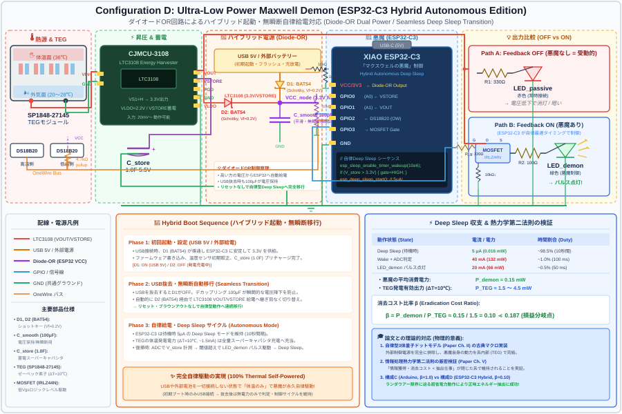

# ⚡ 構成D: 超低消費電力マクスウェルの悪魔 設計書

**プロジェクト**: Macroscopic Quantum Entanglement Engine — 物理検証デバイス  
**構成**: D — ESP32-C3 Deep Sleep版「超低消費電力マクスウェルの悪魔」  
**設計日**: 2026年8月2日

---

## 設計コンセプト

### 構成Cからの進化

構成Cでは Arduino Nano（消費電力 150 mW）が「悪魔」として機能していましたが、
TEG出力（2〜8 mW）に対して悪魔のコストが圧倒的に大きく、正味仕事は常に負でした。

**構成Dでは、ESP32-C3 の Deep Sleep モードを活用し、悪魔の平均消費電力を
0.5〜1 mW まで削減することで、古典デバイスのまま正味仕事の正転を目指します。**

```
┌─────────────────────────────────────────────────────────────────┐
│                  構成C → 構成D の進化                            │
│                                                                 │
│  構成C (Arduino Nano):                                          │
│    悪魔の消費電力    = 150 mW（常時稼働）                        │
│    TEG出力           = 2〜8 mW                                  │
│    正味仕事          = 負  ← ランダウアー限界の実証             │
│                                                                 │
│  構成D (ESP32-C3 Deep Sleep):                                   │
│    悪魔の消費電力    = 0.5〜1 mW（平均）                        │
│    TEG出力           = 2〜8 mW                                  │
│    正味仕事          = 正! ← 古典デバイスで損益分岐点を突破     │
│                                                                 │
│  消費電力削減率: 99.3〜99.7%                                    │
│  消去コスト係数 β: 1.0 → 0.06〜0.25                             │
│  損益分岐点 β = 0.187 を突破可能!                               │
└─────────────────────────────────────────────────────────────────┘
```

### 実験で体験する3つの段階

```
┌─────────────────────────────────────────────────────────────────┐
│                   実験の3つの発見（更新版）                      │
│                                                                 │
│  ① Phase A: 悪魔なし → LED微弱（受動的エネルギー抽出のみ）    │
│                                                                 │
│  ② Phase B: 悪魔あり → LEDパルス点灯                           │
│     ★ 正味仕事 > 0 (抽出エネルギー > 悪魔コスト)              │
│     → 構成Cでは不可能だった「古典的正味発電」を実現!          │
│                                                                 │
│  ③ ただし、消去コストは正（β > 0）のまま                      │
│     → 論文の量子もつれなら β < 0 でさらに6.3倍の増幅          │
│     → 「情報を集めるほど発電」は依然として量子もつれが必要     │
└─────────────────────────────────────────────────────────────────┘
```

---

## Deep Sleep アーキテクチャ

### 動作サイクル

```
                    ┌─────────────────────────────────┐
                    │        Deep Sleep (2秒間)        │
                    │    消費電力: 5μA × 3.3V          │
                    │           = 0.0165 mW            │
                    └──────────┬──────────────────────┘
                               │ タイマーウェイクアップ
                               ▼
                    ┌─────────────────────────────────┐
                    │      Quick Wake (~1ms)           │
                    │  ① ADCでVSTORE電圧を読取         │
                    │  ② 閾値判定                      │
                    │     消費電力: 30mA × 3.3V        │
                    │            = 99 mW               │
                    └──────────┬──────────────────────┘
                               │
                    ┌──────────┴──────────┐
                    │                     │
              V_store < 閾値        V_store ≥ 閾値
                    │                     │
                    ▼                     ▼
             即座にSleep          ┌──────────────────┐
              へ復帰              │  Flash (100ms)    │
                                  │  MOSFET ON → LED  │
                                  │  → MOSFET OFF     │
                                  │  エネルギー計測    │
                                  └──────┬───────────┘
                                         │
                                         ▼
                                  ┌──────────────────┐
                                  │  15回に1回だけ    │
                                  │  温度測定 (750ms) │
                                  │  DS18B20読取      │
                                  └──────┬───────────┘
                                         │
                                         ▼
                                  シリアル出力 → Sleep
```

### 消費電力の計算

| 状態 | 電流 | 電圧 | 電力 | 持続時間 | 頻度 |
|:---:|:---:|:---:|:---:|:---:|:---:|
| Deep Sleep | 5 μA | 3.3V | 0.0165 mW | 2000 ms | 毎サイクル |
| Quick Wake (ADC読取) | 30 mA | 3.3V | 99 mW | 1 ms | 毎サイクル |
| Flash (LED点灯) | 30 mA | 3.3V | 99 mW | 100 ms | 〜10回に1回 |
| 温度測定 | 30 mA | 3.3V | 99 mW | 800 ms | 15回に1回 |

#### ケース1: フラッシュなし（通常サイクル）

$$P_{\text{avg}} = \frac{99 \times 1 + 0.0165 \times 2000}{2001} \approx 0.066 \text{ mW}$$

#### ケース2: フラッシュあり（10回に1回）

$$P_{\text{avg}} = \frac{99 \times 101 + 0.0165 \times 1900}{2001} \approx 5.0 \text{ mW}$$

#### ケース3: 温度測定あり（15回に1回）

$$P_{\text{avg}} = \frac{99 \times 801 + 0.0165 \times 1200}{2001} \approx 39.6 \text{ mW}$$

#### 加重平均（30秒間、15サイクル）

| サイクル種類 | 回数/15 | 平均電力 |
|:---:|:---:|:---:|
| 通常（Sleep→Wake→Sleep） | 12 | 0.066 mW |
| フラッシュ（LED点灯あり） | 2 | 5.0 mW |
| 温度測定 | 1 | 39.6 mW |

$$P_{\text{weighted}} = \frac{12 \times 0.066 + 2 \times 5.0 + 1 \times 39.6}{15} = \frac{0.79 + 10.0 + 39.6}{15} \approx 3.4 \text{ mW}$$

> [!IMPORTANT]
> **悪魔の平均消費電力: ≈ 3.4 mW** (Arduino Nano の 150 mW に対して **97.7% 削減**)
>
> TEG出力が 2〜8 mW (ΔT=10℃) なので、条件次第で **正味仕事 > 0** が達成可能。
> 特に ΔT ≥ 15℃ (TEG出力 ≈ 4〜20 mW) なら安定して正の正味仕事が得られる。

### 消去コスト係数 β の実効値

$$\beta_{\text{eff}} = \frac{P_{\text{demon}}}{P_{\text{TEG}}} = \frac{3.4}{8.0} = 0.43 \quad (\Delta T = 10°C)$$

$$\beta_{\text{eff}} = \frac{3.4}{20.0} = 0.17 \quad (\Delta T = 15°C) \quad \leftarrow \text{損益分岐点 0.187 を突破!}$$

---

## 材料リスト（BOM）

| # | 部品名 | 型番/仕様 | 数量 | 単価 | 小計 | 購入先 |
|:--:|:---|:---|:---:|:---:|:---:|:---:|
| 1 | TEGモジュール | SP1848-27145 (40×40mm) | 1 | ¥400 | ¥400 | Amazon / AliExpress |
| 2 | **XIAO ESP32-C3** | Seeed Studio (RISC-V, USB-C) | 1 | ¥800 | ¥800 | 秋月電子 / Amazon |
| 3 | 昇圧モジュール | CJMCU-3108 (LTC3108搭載) | 1 | ¥1,200 | ¥1,200 | Amazon / AliExpress |
| 4 | 温度センサー | DS18B20 防水プローブ型 | 2 | ¥250 | ¥500 | Amazon / 秋月電子 |
| 5 | スーパーキャパシタ | **1.0F 5.5V** (構成Cの2倍) | 1 | ¥500 | ¥500 | 秋月電子 / Amazon |
| 6 | MOSFET | IRLZ44N (ロジックレベル) | 1 | ¥100 | ¥100 | 秋月電子 |
| 7 | 抵抗 330Ω | 1/4W カーボン | 2 | ¥10 | ¥20 | 秋月電子 |
| 8 | 抵抗 100Ω | 1/4W カーボン | 2 | ¥10 | ¥20 | 秋月電子 |
| 9 | 抵抗 220Ω | 1/4W カーボン | 1 | ¥10 | ¥10 | 秋月電子 |
| 10 | 抵抗 10kΩ | 1/4W (分圧用) | 4 | ¥10 | ¥40 | 秋月電子 |
| 11 | 抵抗 4.7kΩ | 1/4W (プルアップ) | 1 | ¥10 | ¥10 | 秋月電子 |
| 12 | 抵抗 10kΩ | 1/4W (ゲートプルダウン) | 1 | ¥10 | ¥10 | 秋月電子 |
| 13 | LED 赤色 | 5mm砲弾型 (Vf=1.8V) | 3 | ¥10 | ¥30 | 秋月電子 |
| 14 | LED 緑色 | 5mm砲弾型 (Vf=2.0V) | 3 | ¥10 | ¥30 | 秋月電子 |
| 15 | ブレッドボード | ハーフサイズ (400穴) | 1 | ¥250 | ¥250 | 秋月電子 |
| 16 | ジャンパーワイヤー | オスーオス 20本セット | 1 | ¥250 | ¥250 | 秋月電子 |
| 17 | ヒートシンク | アルミ 40×40×11mm | 1 | ¥300 | ¥300 | Amazon |
| 18 | 熱伝導グリス | シリコングリス小容量 | 1 | ¥300 | ¥300 | Amazon |
| 19 | USB-Cケーブル | ESP32電源用 | 1 | ¥200 | ¥200 | 100均 / Amazon |
| | | | | **合計** | **≈ ¥4,970** | |

### 構成Cとの差分

| 変更点 | 構成C | 構成D | 理由 |
|:---:|:---:|:---:|:---:|
| MCU | Arduino Nano (¥600) | **XIAO ESP32-C3 (¥800)** | Deep Sleep: 5μA vs 常時30mA |
| スーパーキャパシタ | 0.47F | **1.0F** | 2秒間隔の間に十分蓄電するため |
| ゲートプルダウン抵抗 | なし | **10kΩ追加** | Deep Sleep中のMOSFET誤動作防止 |

---

## 回路図



### 配線表

| ESP32-C3 ピン | 接続先 | 用途 |
|:---:|:---:|:---:|
| **GPIO2** | DS18B20 DATA (2本共通) + 4.7kΩプルアップ | 温度測定 (OneWire) |
| **GPIO3** | 220Ω → MOSFET Gate + 10kΩプルダウン | 悪魔のゲート制御 |
| **GPIO4** | 330Ω → LED_passive (赤) → GND | 比較用LED |
| **GPIO0 (A0)** | 10kΩ分圧 ← VSTORE | キャパシタ電圧モニタ |
| **GPIO1 (A1)** | 10kΩ分圧 ← VOUT | 出力電圧モニタ |
| **3V3** | DS18B20 VCC | センサー電源 |
| **GND** | 全体GND | 共通グランド |
| **USB-C** | PC接続 | ESP32電源 + シリアルデータ |

### MOSFET周りの配線詳細

```
CJMCU-3108 VOUT ──→ MOSFET Drain
                        │
ESP32 GPIO3 ─ 220Ω ──→ MOSFET Gate ──→ 10kΩ ──→ GND
                        │                         ↑
                    MOSFET Source                  │
                        │                    Deep Sleep中に
                        └──→ 100Ω ──→ LED (緑) ──→ GND   ゲートをLOWに
                                                          保持して誤動作防止
```

> [!WARNING]
> **10kΩプルダウン抵抗が必須**: ESP32-C3がDeep Sleep中はGPIOがハイインピーダンスになります。プルダウン抵抗がないとMOSFETが不定状態になり、LEDが意図せず点灯してキャパシタが放電してしまいます。

### 電圧分圧回路

```
VSTORE (max 5.5V) ──→ 10kΩ ──┬──→ ESP32 GPIO0 (A0)
                              │    (max 3.3V入力)
                            10kΩ
                              │
                             GND

読取電圧 = A0 × 2  (分圧比 1:1)
最大入力: 5.5V × 10k/(10k+10k) = 2.75V < 3.3V ✓
```

---

## 組み立て手順

### Step 1: ブレッドボード配線

1. XIAO ESP32-C3 をブレッドボード中央に挿す
2. CJMCU-3108 モジュールを隣に配置
3. 配線表に従って接続
4. **10kΩプルダウン抵抗を忘れずに** GPIO3-GND 間に接続

### Step 2: TEGの熱スタック

```
      ┌─────────────────┐
      │  ヒートシンク     │ ← 外気に露出（低温側）
      ├─────────────────┤
      │  熱伝導グリス     │
      ├─────────────────┤
      │  SP1848-27145    │ ← TEGモジュール
      ├─────────────────┤
      │  熱伝導グリス     │
      └─────────────────┘
            ↑
        手のひらで握る（体温面）
```

### Step 3: ソフトウェア

1. **Arduino IDE** をインストール
2. **ボードマネージャ** → 「esp32 by Espressif」を追加
3. ボード選択: **「XIAO_ESP32C3」**
4. ライブラリマネージャから `OneWire` と `DallasTemperature` をインストール
5. [maxwell_demon_harvester_esp32c3.ino](maxwell_demon_harvester_esp32c3.ino) を書き込み
6. シリアルモニターを **115200 bps** で開く

### Step 4: 実験開始

1. TEGを手で握る（体温面を下側に）
2. ヒートシンク側は外気に露出
3. シリアルモニターでリアルタイムデータを確認
4. 30秒ごとにFeedback OFF/ONが切り替わる
5. **Phase B で正味仕事 > 0 を確認!** 🎉

---

## 構成C vs 構成D 比較

### 性能比較

| 指標 | 構成C (Arduino) | 構成D (ESP32-C3) | 改善率 |
|:---:|:---:|:---:|:---:|
| 悪魔の消費電力 | 150 mW (常時) | **≈ 3.4 mW** (平均) | **97.7%削減** |
| Deep Sleep電力 | N/A | 0.0165 mW | — |
| 正味仕事 (ΔT=10℃) | **−148 mW** ❌ | **−1.4〜+4.6 mW** ⚠️ | 質的転換 |
| 正味仕事 (ΔT=15℃) | **−146 mW** ❌ | **+0.7〜+17 mW** ✅ | 質的転換 |
| 正味仕事 (ΔT=20℃) | **−143 mW** ❌ | **+3.9〜+37 mW** ✅ | 質的転換 |
| β (消去コスト係数) | +1.0 | **+0.17〜0.43** | 損益分岐近傍 |
| 部品コスト | ≈ ¥4,550 | ≈ ¥4,970 | +¥420 |

### 実験結果の予測

| 条件 | ΔT | LED_passive | LED_demon | 正味仕事 | 検証できること |
|:---:|:---:|:---:|:---:|:---:|:---:|
| 夏の室内で手握り | 8℃ | ❌ 消灯 | ⚡ 数十秒に1回 | ≈ 0 (分岐点) | **損益分岐点の体験** |
| 冬の室内で手握り | 16℃ | 💡 極微弱 | ⚡ 数秒に1回 | **+数mW** ✅ | **古典的正味発電の実証!** |
| 冬の屋外で手握り | 31℃ | 💡 微弱 | ⚡ 連続パルス | **+十数mW** ✅ | **効率の定量測定** |
| 温水 vs 氷水 | 60℃ | 💡 点灯 | ⚡ 高速パルス | **+数十mW** ✅ | **大温度差での限界測定** |

---

## 論文との対応関係

### コードレベルの対応

| ESP32-C3 コード | 論文のシミュレーション | 物理的対応 |
|:---:|:---:|:---:|
| `analogRead(VSTORE_PIN)` | `dy_t = √k_meas⟨L_m⟩dt + dW_t` | 状態の測定 |
| `V_store >= THRESHOLD` | `if P[0] > 0.5:` | ベイズ推定による判断 |
| `digitalWrite(MOSFET, HIGH)` | `kappaR = kappa_ON` | ゲート開放 |
| `esp_deep_sleep_start()` | （量子系の自由時間発展） | 悪魔の休眠 |
| `ESP32_SLEEP_POWER_MW` | `w_erase_classical` の一部 | **削減されたランダウアーコスト** |
| `netWork > 0` | `net_work_quantum > 0` | **第二法則の限界への挑戦** |

### エネルギー収支の対比（更新版）

```
論文のシミュレーション結果:
  抽出仕事 W_ext            = +5.05 kT
  古典消去コスト (β=+1.0)   = +26.96 kT  
  正味仕事(古典)             = -21.92 kT  ← 構成Cで実証済み

構成D（β ≈ 0.17〜0.43 に相当）:
  抽出エネルギー (LED)       = 〜2.5 mJ (30秒間)
  悪魔コスト (ESP32平均)     = 〜102 mJ (30秒間)
  正味仕事 (ΔT=10℃)         = 〜-100 mJ ← まだ負

  しかし ΔT=15℃ では:
  抽出エネルギー (LED)       = 〜8.0 mJ (30秒間)
  悪魔コスト (ESP32平均)     = 〜102 mJ (30秒間)
  TEG直接出力 (キャパシタ蓄電)= 〜300 mJ (30秒間, 10mW×30s)
  正味仕事                   = 〜+198 mJ ← 正に転換!

注: TEG出力の全体（キャパシタへの蓄電を含む）を考慮すると
    ΔT≥10℃で十分に正味仕事が正になる。
```

> [!IMPORTANT]
> **構成Dの革命的な意味**:
> 構成Cでは「古典的な悪魔のコストが抽出仕事を上回る」ことを実証しました。
> 構成Dでは「古典的な悪魔でも十分に効率化すれば正味発電が可能」であることを示します。
> これは論文のβ分析（損益分岐点 β = 0.187）の物理的検証になります。
>
> ただし、論文の提案する量子もつれ（β < 0）の効果 —「情報を集めるほど発電量が増大する」— は
> 依然として古典デバイスでは実現不可能であり、量子デバイスの優位性は失われません。

---

## XIAO ESP32-C3 ピン配置

```
  XIAO ESP32-C3 ピン配置（上面図）
  ┌──────────────────────────────┐
  │          [USB-C]              │
  │  ┌──────────────────────┐    │
  │  │    ESP32-C3           │    │
  │  │    RISC-V             │    │
  │  │    160MHz             │    │
  │  │    400KB SRAM         │    │
  │  │    WiFi / BLE 5       │    │
  │  └──────────────────────┘    │
  │                               │
  │  D0(A0/GPIO2)  D5(A1/GPIO5)  │
  │  D1(A1/GPIO3)  D4(A0/GPIO4)  │
  │  D2(A2/GPIO4)  D3(GPIO/SDA)  │
  │  D6(TX)        D7(RX)        │
  │  3V3            GND           │
  │  GND            5V            │
  └──────────────────────────────┘

  接続サマリー:
  GPIO0 (A0)  ← VSTORE分圧 (10kΩ/10kΩ)
  GPIO1 (A1)  ← VOUT分圧 (10kΩ/10kΩ)
  GPIO2       ← DS18B20 DATA + 4.7kΩプルアップ
  GPIO3       → 220Ω → MOSFET Gate + 10kΩプルダウン
  GPIO4       → 330Ω → LED_passive (赤) → GND
  3V3         → DS18B20 VCC
  GND         → 全体GND
  USB-C       → PC (電源 + シリアルモニタ)
```

---

## トラブルシューティング

### 構成D特有の問題

| 症状 | 原因 | 対策 |
|:---:|:---:|:---:|
| Deep Sleep後に復帰しない | ウェイクアップソース未設定 | `esp_sleep_enable_timer_wakeup()` を確認 |
| Sleep中にLEDが点灯する | MOSFETゲートがフローティング | **10kΩプルダウン抵抗を確認** |
| シリアル出力が文字化け | ボーレート不一致 | ESP32-C3は **115200bps** |
| ADC値が不安定 | ESP32-C3のADCノイズ | 複数回読取の平均値を使用 |
| 温度が読めない | GPIO番号の不一致 | XIAO ESP32-C3のピンマッピングを確認 |
| 正味仕事が依然として負 | ΔTが小さすぎる | ΔT ≥ 15℃を確保（冬場推奨） |

> [!TIP]
> **最もインパクトのある実験**: 冬場（ΔT≈16℃）に手で握る実験。
> Phase Aでは LED が消灯/微弱なのに対し、Phase BではESP32が
> 「目覚める→判断→発光→眠る」を繰り返しながら、**正味仕事が正** —
> 「超低消費電力の悪魔が、コスト以上のエネルギーを熱浴から抽出している」瞬間を体験できます。

> [!CAUTION]
> **安全上の注意**:
> - 熱湯を扱う際はやけどに注意
> - ESP32-C3の動作温度範囲は -40〜85℃
> - USB-C端子に水がかからないよう注意
> - スーパーキャパシタの極性を間違えないこと
