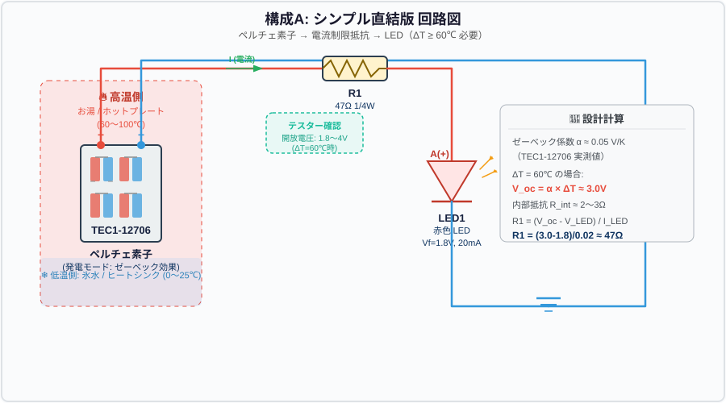
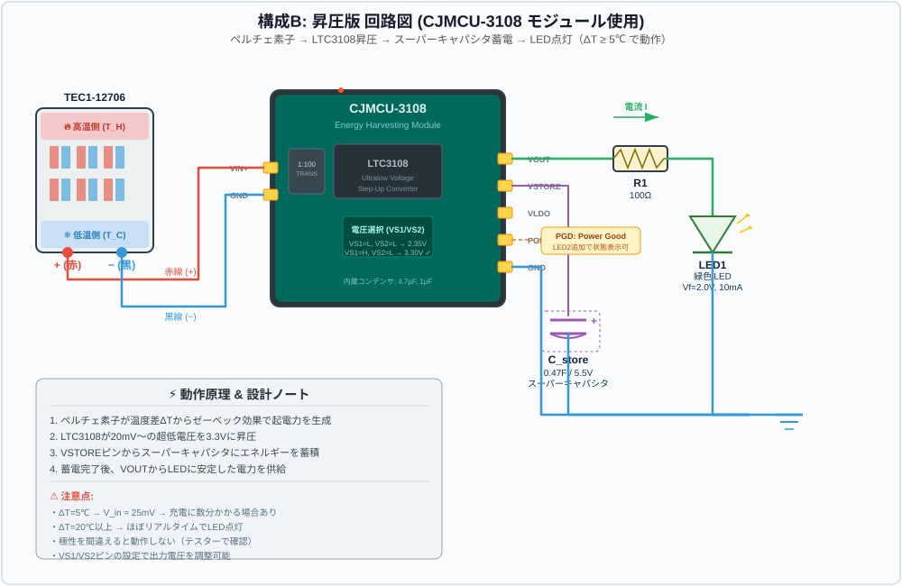
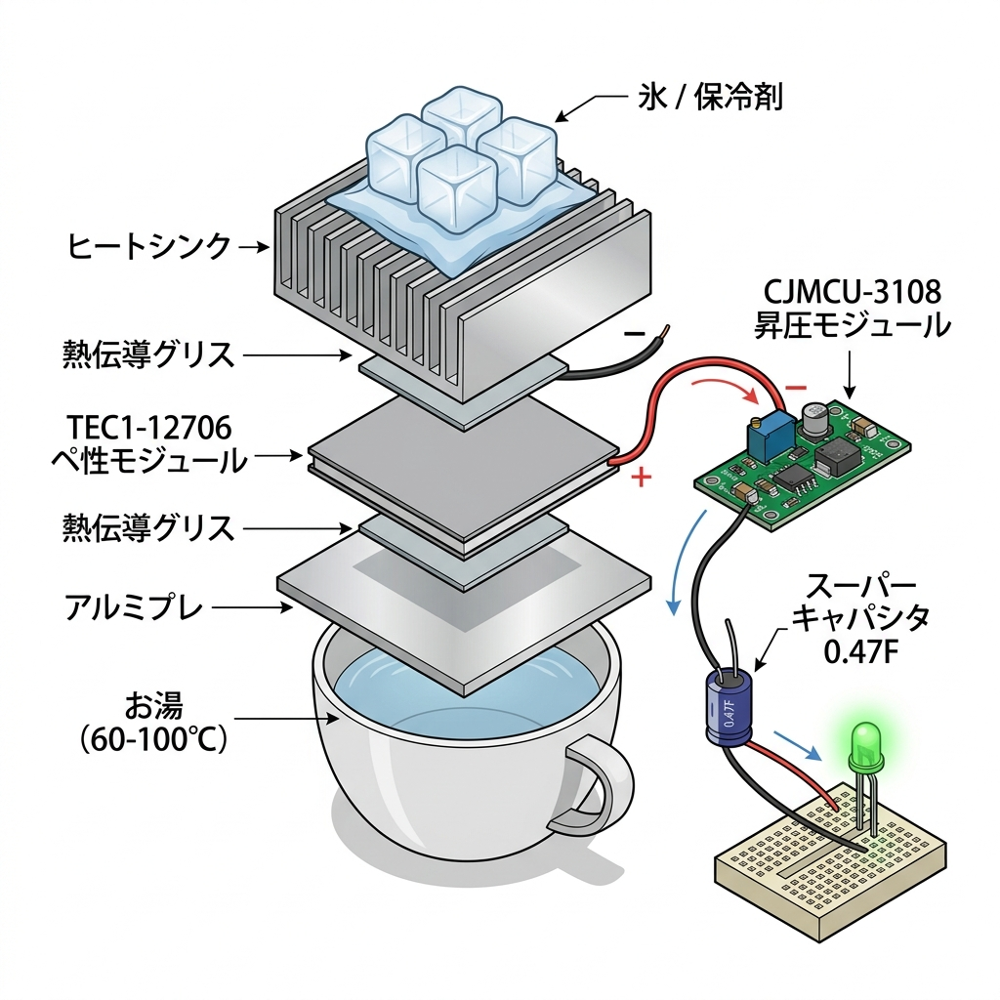
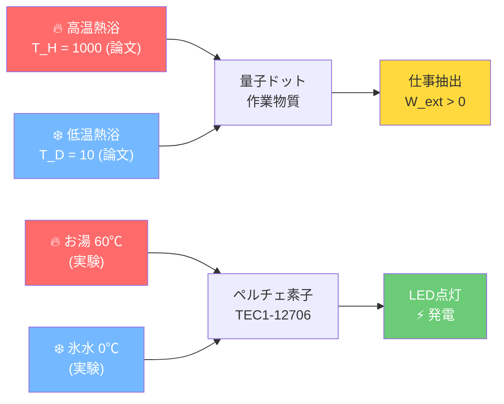

# 🔋 温度差発電デモンストレーター 設計書

**プロジェクト**: Macroscopic Quantum Entanglement Engine — 物理検証デバイス  
**目的**: 論文「Breaking the Second Law Limits」の核心概念を物理的に検証  
**設計日**: 2026年7月30日

---

## 📋 目次

1. [設計コンセプト](#1-設計コンセプト)
2. [構成A: シンプル直結版](#2-構成a-シンプル直結版)
3. [構成B: 昇圧版（推奨）](#3-構成b-昇圧版推奨)
4. [材料リスト（BOM）](#4-材料リストbom)
5. [回路図](#5-回路図)
6. [組み立て図と手順](#6-組み立て図と手順)
7. [理論と実験の対応関係](#7-理論と実験の対応関係)
8. [測定と検証方法](#8-測定と検証方法)
9. [トラブルシューティング](#9-トラブルシューティング)

---

## 1. 設計コンセプト

### 研究との接点

論文の3体量子ドット情報エンジンは、**異なる温度の熱浴間の温度差**を利用してエネルギーを抽出する自律型デバイスです。

```
論文の量子エンジン                    検証デモンストレーター
┌──────────────────────┐         ┌──────────────────────────────┐
│ 高温熱浴 (T_H)       │  ←→     │ お湯 / ホットプレート        │
│ 低温熱浴 (T_C)       │  ←→     │ 氷水 / ヒートシンク          │
│ 量子ドット作業物質    │  ←→     │ ペルチェ素子（ゼーベック効果）│
│ エネルギー抽出（仕事）│  ←→     │ LED点灯（電気エネルギー）    │
│ 情報フロー制御        │  ←→     │ LTC3108昇圧回路（構成B）     │
└──────────────────────┘         └──────────────────────────────┘
```

### ゼーベック効果の原理

ペルチェ素子（熱電素子）の両面に温度差 ΔT を与えると、内部のP型・N型半導体の接合部で熱起電力が生じます：

$$V_{oc} = \alpha \times \Delta T$$

- $\alpha$: ゼーベック係数（TEC1-12706: 約 0.04〜0.05 V/K モジュール全体）
- $\Delta T$: 高温側と低温側の温度差 [K]

---

## 2. 構成A: シンプル直結版

> [!NOTE]
> 最もシンプルな構成。部品点数3つのみ。**ΔT ≥ 60℃** が必要。

### 動作条件

| パラメータ | 値 |
|:--------:|:----:|
| 必要温度差 | ≥ 60℃ |
| 開放電圧 (ΔT=60℃) | ≈ 2.4〜3.0V |
| LED順方向電圧 | 1.8V（赤色LED） |
| 電流制限抵抗 | 47Ω（1/4W） |
| 期待電流 | ≈ 10〜25mA |

### 回路構成

```
  ┌─────────────────────────────────────────────┐
  │                                             │
  │  TEC1-12706        R1 (47Ω)      LED1      │
  │  ┌──────────┐   ┌───────┐    ┌──────┐      │
  │  │  ペルチェ │   │       │    │  赤色 │      │
  ├──┤(+) 素子(−)├───┤ 抵抗  ├────┤  LED  ├──┐  │
  │  │  ΔT≥60℃  │   │       │    │      │  │  │
  │  └──────────┘   └───────┘    └──────┘  │  │
  │                                        │  │
  └────────────────────────────────────────┘  │
                        GND ──────────────────┘
```

---

## 3. 構成B: 昇圧版（推奨）

> [!IMPORTANT]
> **この構成を推奨します。** 微小な温度差（ΔT ≈ 5〜10℃）でもLEDを点灯可能で、論文の「微小温度差からのエネルギーハーベスティング」の本質に最も近いデモンストレーションになります。

### 動作条件

| パラメータ | 値 |
|:--------:|:----:|
| 最低動作温度差 | ≈ 1〜3℃ |
| LTC3108 最低入力電圧 | 20mV |
| 出力電圧 | 3.3V（VS1/VS2設定） |
| スーパーキャパシタ | 0.47F / 5.5V |
| LED | 緑色 (Vf=2.0V) |
| 電流制限抵抗 | 100Ω |

### 回路構成

```
                    ┌─────────────────────────────────┐
                    │        CJMCU-3108 Module        │
                    │  ┌─────────────────────────┐    │
  TEC1-12706        │  │                         │    │
  ┌──────────┐      │  │      LTC3108            │    │
  │          │(+)───┼──┤ VIN+              VOUT ├──┬─┼──── R1 ──── LED1 ──┐
  │  ペルチェ │      │  │                         │  │ │                    │
  │          │(−)───┼──┤ GND             VSTORE ├──┼─┼──── C_store ────┐  │
  │  素子    │      │  │                         │  │ │    (0.47F)     │  │
  └──────────┘      │  │              VS1=H (3.3V)│  │ │                │  │
                    │  │              VS2=L       │  │ │                │  │
                    │  │                    GND  ├──┼─┼────────────────┘  │
                    │  └─────────────────────────┘  │ │                    │
                    └───────────────────────────────┘ │                    │
                                                      └────────────────────┘
                                                              GND
```

---

## 4. 材料リスト（BOM）

### 構成A: シンプル直結版

| # | 部品名 | 型番/仕様 | 数量 | 単価（税込） | 小計 | 購入先 |
|:-:|:------|:---------|:---:|:---------:|:---:|:------|
| 1 | ペルチェ素子 | TEC1-12706 (40×40mm, 12V 6A) | 1 | ¥500〜800 | ¥800 | Amazon / 秋月電子 / AliExpress |
| 2 | 電流制限抵抗 | 47Ω 1/4W カーボン抵抗 | 2 | ¥10 | ¥20 | 秋月電子 / 千石電商 |
| 3 | LED | 赤色砲弾型 5mm (Vf=1.8V, 20mA) | 5 | ¥10 | ¥50 | 秋月電子 |
| 4 | ヒートシンク | アルミ放熱器 40×40×11mm以上 | 1 | ¥200〜400 | ¥400 | Amazon / 秋月電子 |
| 5 | 熱伝導グリス | シリコングリス 小容量 | 1 | ¥300 | ¥300 | Amazon / ホームセンター |
| 6 | リード線 | みのむしクリップ付き (赤・黒) | 2 | ¥100 | ¥200 | 秋月電子 / ダイソー |
| 7 | アルミ板 | 40×40mm 厚さ2mm程度 | 1 | ¥100 | ¥100 | ホームセンター |
| | | | | **合計** | **≈ ¥1,870** | |

### 構成B: 昇圧版（推奨）

| # | 部品名 | 型番/仕様 | 数量 | 単価（税込） | 小計 | 購入先 |
|:-:|:------|:---------|:---:|:---------:|:---:|:------|
| 1 | ペルチェ素子 | TEC1-12706 (40×40mm) | 1 | ¥800 | ¥800 | Amazon / AliExpress |
| 2 | **昇圧モジュール** | **CJMCU-3108** (LTC3108搭載) | 1 | ¥800〜1,500 | ¥1,500 | Amazon / AliExpress |
| 3 | スーパーキャパシタ | 0.47F 5.5V (ゴールドキャパシタ) | 1 | ¥200〜400 | ¥400 | 秋月電子 / Amazon |
| 4 | 電流制限抵抗 | 100Ω 1/4W | 2 | ¥10 | ¥20 | 秋月電子 |
| 5 | LED | 緑色砲弾型 5mm (Vf=2.0V) | 5 | ¥10 | ¥50 | 秋月電子 |
| 6 | ヒートシンク | アルミ放熱器 40×40×20mm | 1 | ¥400 | ¥400 | Amazon / 秋月電子 |
| 7 | 熱伝導グリス | シリコングリス | 1 | ¥300 | ¥300 | Amazon |
| 8 | ブレッドボード | ミニブレッドボード (170穴) | 1 | ¥150 | ¥150 | 秋月電子 |
| 9 | ジャンパーワイヤー | オスーオス 10本セット | 1 | ¥200 | ¥200 | 秋月電子 |
| 10 | みのむしクリップ | リード線付き (赤・黒) | 2 | ¥100 | ¥200 | 秋月電子 |
| 11 | アルミ板 | 40×40mm 厚さ2mm | 1 | ¥100 | ¥100 | ホームセンター |
| | | | | **合計** | **≈ ¥4,120** | |

### 実験用消耗品（共通・家庭にあるもの）

| 品目 | 用途 | 備考 |
|:---:|:---:|:---:|
| お湯 | 高温側熱源 (60〜100℃) | ケトルで沸かす |
| 氷 / 保冷剤 | 低温側冷却 | 冷凍庫から |
| 耐熱容器 | お湯を入れる器 | マグカップ等 |
| テスター | 電圧・電流測定 | デジタルマルチメーター推奨 |

### 購入先リンク

| ショップ | URL | 特徴 |
|:------:|:---:|:---:|
| **秋月電子通商** | https://akizukidenshi.com | 電子部品専門、品揃え豊富 |
| **千石電商** | https://www.sengoku.co.jp | 秋葉原の老舗 |
| **Amazon.co.jp** | https://amazon.co.jp | 翌日配送、モジュール品が豊富 |
| **AliExpress** | https://aliexpress.com | 最安値、ただし配送2〜4週間 |

---

## 5. 回路図

### 構成A: シンプル直結版



### 構成B: 昇圧版（推奨）



---

## 6. 組み立て図と手順

### 物理配置図



### 組み立て手順（構成B）

#### Step 1: 熱伝導スタックの構築

```
      ┌──────────────────┐
      │    氷 / 保冷剤    │ ← 最上部
      ├──────────────────┤
      │  ヒートシンク     │ ← 低温側（冷却面）
      ├──────────────────┤
      │  熱伝導グリス     │ ← 薄く均一に塗布
      ├──────────────────┤
      │  TEC1-12706      │ ← ペルチェ素子（文字が印刷された面が上＝冷却側）
      │  (赤線: +, 黒線: -)│
      ├──────────────────┤
      │  熱伝導グリス     │ ← 薄く均一に塗布
      ├──────────────────┤
      │  アルミ板         │ ← 高温側（加熱面）
      ├──────────────────┤
      │  お湯の入った容器  │ ← 最下部
      └──────────────────┘
```

1. アルミ板の片面に熱伝導グリスを薄く塗布
2. ペルチェ素子を載せる（**印字面が上** ← 注意: 冷却面を上にする）
3. ペルチェ素子の上面にもグリスを塗布
4. ヒートシンクを載せる
5. 氷または保冷剤をヒートシンク上に配置

#### Step 2: 回路の配線（構成B）

1. **ブレッドボード** にCJMCU-3108モジュールを配置
2. ペルチェ素子の **赤線（+）** を CJMCU-3108 の **VIN+** に接続
3. ペルチェ素子の **黒線（−）** を CJMCU-3108 の **GND** に接続
4. **VSTORE** ピンにスーパーキャパシタの **+極** を接続
5. スーパーキャパシタの **−極** を **GND** に接続
6. **VOUT** ピン → **100Ω抵抗** → **LED（アノード/長い脚）** → **GND** の順で接続

> [!WARNING]
> **極性に注意！** ペルチェ素子のどちらが+になるかは温度差の方向で決まります。テスターで確認してから接続してください。高温側を下にした場合、通常は赤線が+です。

#### Step 3: 動作確認

1. アルミ板の下にお湯の入ったカップを置く
2. ヒートシンク上に氷/保冷剤を配置
3. テスターでペルチェ素子の出力電圧を確認（20mV以上あればOK）
4. 回路を接続 → スーパーキャパシタの充電を待つ（1〜5分程度）
5. LEDが点灯したら成功！🎉

---

## 7. 理論と実験の対応関係

### 論文の概念とデモの対応マッピング



### 詳細対応表

| 論文の概念 | シミュレーション | デモ装置 | 対応する物理 |
|:--------:|:----------:|:-------:|:---------:|
| **高温熱浴** $T_H$ | `T = 1000.0` (kT単位) | お湯 (60〜100℃) | 熱源からの熱流入 |
| **低温熱浴** $T_C$ | `TD = 10.0` (kT単位) | 氷水/ヒートシンク (0〜25℃) | 冷却面からの熱排出 |
| **量子ドット** (作業物質) | `dL, dR` 演算子 | ペルチェ素子内のP-N半導体対 | 温度差による起電力生成 |
| **クーロン相互作用** $U$ | `U = 200.0` | ゼーベック係数 α | エネルギー変換の結合定数 |
| **仕事抽出** $W_{ext}$ | `W_dot = (muL-muR) * I` | LED消費電力 $P = V \times I$ | 温度差からの正味エネルギー |
| **情報エンジン制御** | ベイズ推定フィードバック | LTC3108昇圧回路 | 微小信号を有用な出力に変換 |
| **ランダウアー消去コスト** | `w_erase_classical` | 昇圧ICの消費電力 | エネルギー変換の効率損失 |
| **第二法則の限界** | `net_work_classical < 0` | 温度差なし → 発電不可 | ΔT=0 では仕事抽出不可 |

### 核心的な対応

> [!IMPORTANT]
> **論文の核心メッセージ**: 
> 温度差（情報の非対称性）が存在する限り、系からエネルギーを抽出できる。
> ただし、全体系のエントロピー収支は第二法則に従う。
> 
> **デモでの体験**:
> - ΔT > 0 → LED点灯（エネルギー抽出成功）
> - ΔT = 0 → LED消灯（第二法則による禁止）
> - ΔT を大きくする → LEDが明るくなる（抽出仕事の増大）

### エネルギー収支の理論的計算

論文の[simulate_engine.py](file:///home/imaken/notebook_project/Maxwells_demon/simulate_engine.py)における仕事抽出率：

$$\dot{W} = (\mu_L - \mu_R) \times I_{R \to L}$$

デモ装置での電力：

$$P_{LED} = V_{LED} \times I_{LED} = \frac{(V_{oc} - V_{LED})}{R_1} \times V_{LED}$$

両者とも **温度差に起因する熱起電力** を仕事に変換するという共通の物理原理に基づいています。

---

## 8. 測定と検証方法

### 基本測定項目

| 測定項目 | 測定方法 | 期待値 (ΔT=60℃) |
|:------:|:------:|:-------------:|
| 開放電圧 $V_{oc}$ | テスター DC電圧モード | 2.4〜3.0V |
| 短絡電流 $I_{sc}$ | テスター DC電流モード (A) | 0.5〜1.0A |
| 内部抵抗 $R_{int}$ | $V_{oc} / I_{sc}$ | 2〜5Ω |
| LED点灯時電圧 | LED両端電圧 | 1.7〜1.9V (赤) |
| LED点灯時電流 | 直列に電流計 | 10〜25mA |

### 温度差を変化させた測定

以下の実験で **温度差と発電量の関係** を定量的に確認できます：

| 実験条件 | ΔT (約) | 期待開放電圧 | LED状態 |
|:------:|:------:|:---------:|:------:|
| 手のひら vs 室温 | 5〜10℃ | 50〜200mV | 構成Bのみ点灯 |
| ぬるま湯 vs 室温 | 15〜20℃ | 0.6〜1.0V | 構成B: 数分で点灯 |
| 温水 vs 氷水 | 40〜60℃ | 1.6〜3.0V | 構成A: 直接点灯 |
| 熱湯 vs 氷水 | 80〜100℃ | 3.2〜5.0V | 両構成: 即座に明るく点灯 |

### 記録シート（テンプレート）

```
┌──────────────────────────────────────────────────────────┐
│ 温度差発電実験 記録シート                                 │
├──────────┬──────────┬──────────┬──────────┬──────────────┤
│ 実験番号  │ T_H (℃)  │ T_C (℃)  │ ΔT (℃)  │ V_oc (mV)    │
├──────────┼──────────┼──────────┼──────────┼──────────────┤
│ 1        │          │          │          │              │
│ 2        │          │          │          │              │
│ 3        │          │          │          │              │
│ 4        │          │          │          │              │
│ 5        │          │          │          │              │
├──────────┴──────────┴──────────┴──────────┴──────────────┤
│ LED状態: □ 消灯  □ 微弱点灯  □ 明確点灯  □ 高輝度点灯   │
│ 構成: □ A (直結)  □ B (昇圧)                              │
│ 備考:                                                     │
└──────────────────────────────────────────────────────────┘
```

---

## 9. トラブルシューティング

### よくある問題と対策

| 症状 | 原因 | 対策 |
|:---:|:---:|:---:|
| LEDが全く光らない | 極性が逆 | テスターで+/-を確認して接続し直す |
| LEDが全く光らない | 温度差不足 | お湯をより高温に / 氷をしっかり接触させる |
| LEDが暗い | 温度差が小さい | ヒートシンクと氷の接触面積を増やす |
| すぐにLEDが消える | 温度が均一化した | 氷を追加 / お湯を交換する |
| 構成Bで充電されない | CJMCU-3108の入力電圧不足 | ΔT ≥ 5℃を確保 / 入力極性確認 |
| 構成Bで出力電圧が低い | VS1/VS2設定が間違い | データシート参照で3.3V設定に |
| 熱伝導が悪い | グリス塗布不良 | 薄く均一に塗り直す |

> [!TIP]
> **最も重要なポイント**: 温度差を維持し続けることがこの実験の鍵です。ヒートシンクに十分な量の氷を載せ、アルミ板がお湯にしっかり接触していることを確認してください。

> [!CAUTION]
> **安全上の注意**:
> - 熱湯を扱う際はやけどに注意
> - ペルチェ素子は最大耐熱温度（約138℃）を超えないこと
> - 短絡（ショート）させないこと — 内部抵抗が低いため大電流が流れる可能性あり

---

## 付録: CJMCU-3108 モジュールのピン配置

```
  CJMCU-3108 ピン配置（上面図）
  ┌─────────────────────────────┐
  │  [TRANS]                    │
  │  ┌──────┐   ┌────────────┐ │
  │  │1:100 │   │  LTC3108   │ │
  │  │トランス│  │            │ │
  │  └──────┘   └────────────┘ │
  │                             │
  │  VIN+  GND  VS1  VS2       │ ← 入力側ピンヘッダ
  │  VOUT  VLDO VSTORE PGD GND │ ← 出力側ピンヘッダ
  └─────────────────────────────┘
  
  接続サマリー:
  VIN+   ← ペルチェ (+)
  GND    ← ペルチェ (−) & 全体GND
  VOUT   → 100Ω → LED → GND
  VSTORE → スーパーキャパシタ (+)
  VS1    → 3.3V (Hに設定)
  VS2    → GND (Lに設定)
  PGD    → (オプション) 状態表示LED
```
